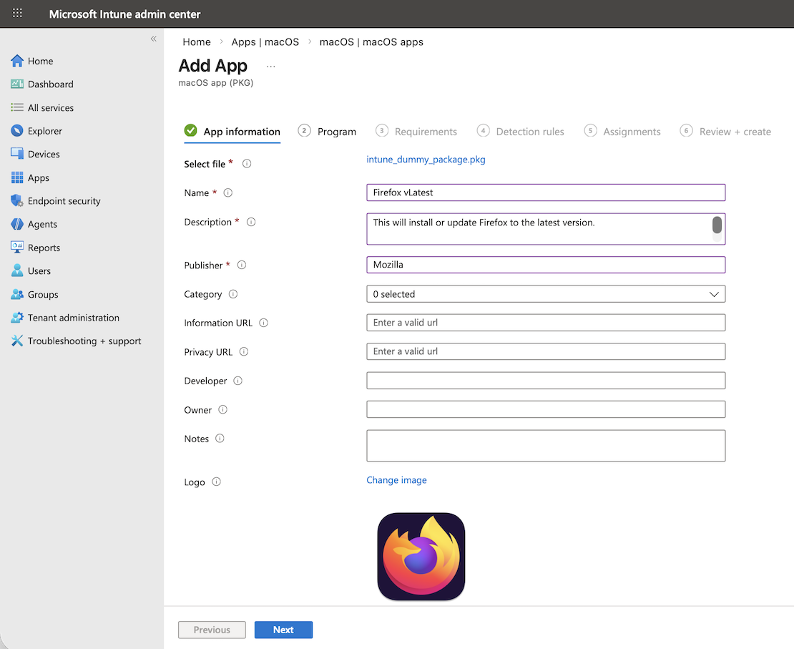
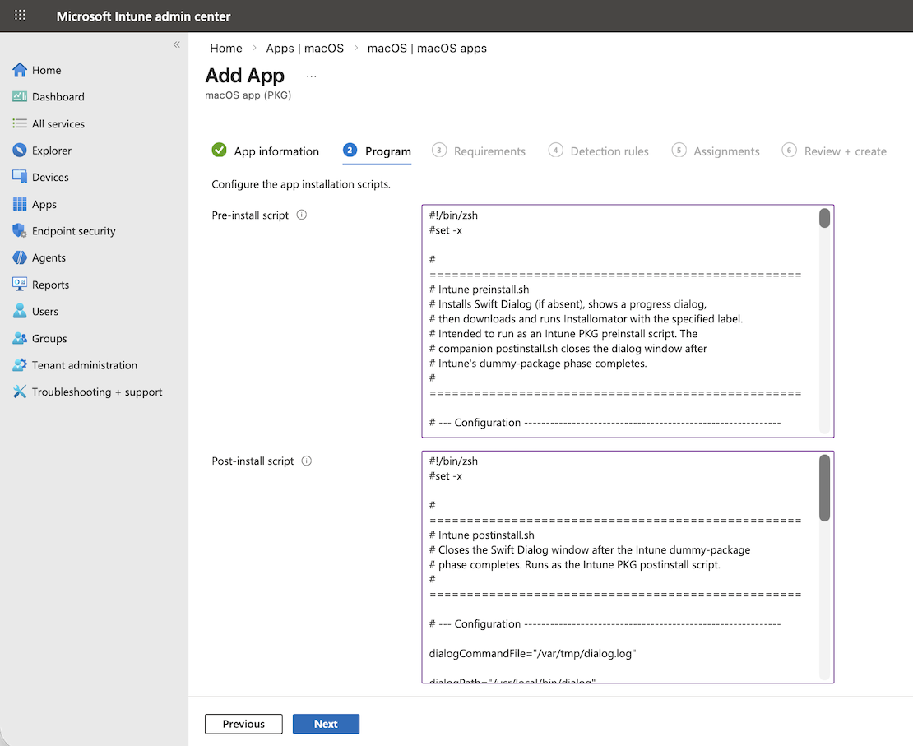
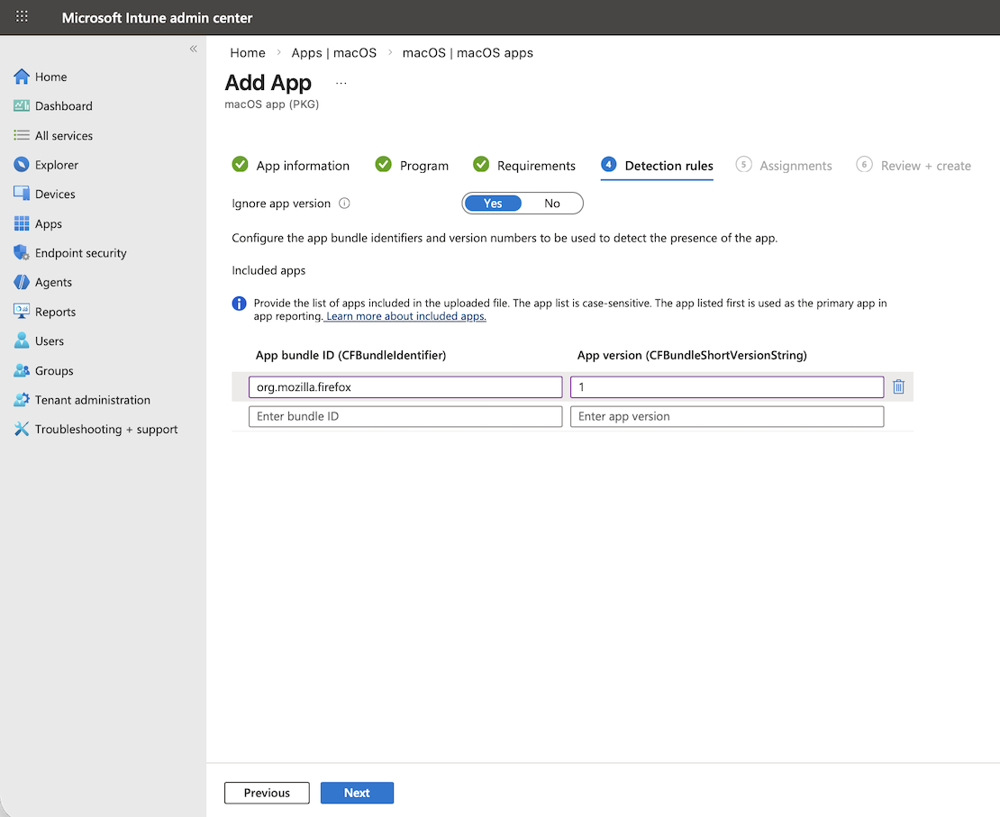
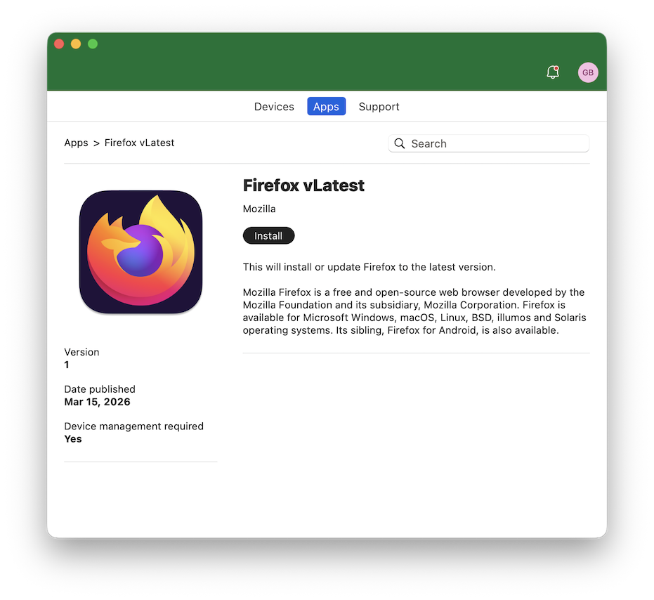
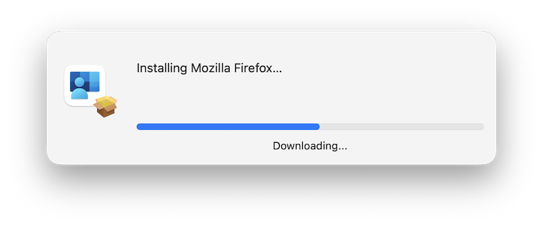
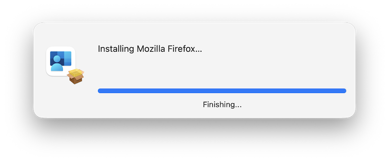
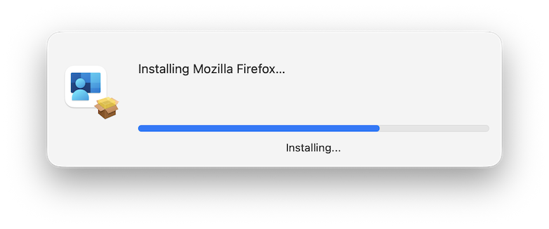
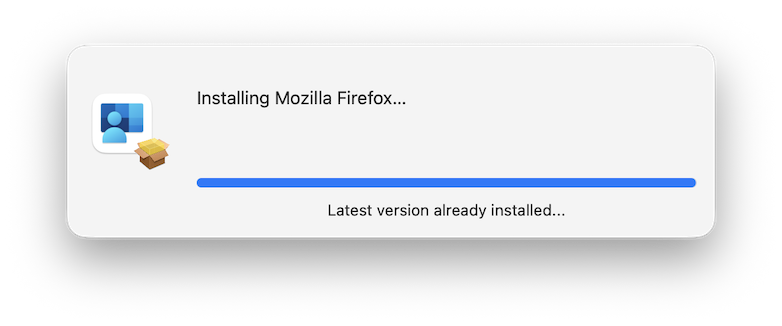

# Installomator + Swift Dialog for Intune PKG Deployment

Deploy any [Installomator](https://github.com/Installomator/Installomator)-supported application through Microsoft Intune's PKG deployment type, with a native [Swift Dialog](https://github.com/swiftDialog/swiftDialog) progress indicator shown to the user during installation.

---

## How It Works

Intune's PKG deployment type supports **preinstall** and **postinstall** scripts that run around the actual package install. This solution takes advantage of that to do all the real work in the scripts, while using a lightweight dummy `.pkg` as the payload Intune actually deploys.

```
[Intune Agent]
      │
      ├─► runs  Intune preinstall.sh   ← installs Swift Dialog (if absent)
      │                                ← launches progress dialog (double-forked)
      │                                ← downloads + runs Installomator
      │
      ├─► installs  intune_dummy_package.pkg   ← no-payload stub
      │                                        ← satisfies Intune
      │
      └─► runs  Intune postinstall.sh  ← signals dialog complete, closes it
```

---

## Repository Contents

| File | Purpose |
|------|---------|
| `Intune preinstall.sh` | Main script. Installs Swift Dialog if absent, shows progress UI, runs Installomator. |
| `Intune postinstall.sh` | Closes the Swift Dialog window after Intune finishes its dummy-package phase. |
| `intune_dummy_package.pkg` | A no-payload stub package. Intune requires an actual `.pkg` to deploy; this satisfies that requirement without installing anything. |

---

## Setup

### 1. Configure the preinstall script

Open `Intune preinstall.sh` and edit the **Configuration** section at the top:

```zsh
# Human-readable name shown in the dialog
installomatorDisplay="Mozilla Firefox"

# Installomator label for the target app
installomatorLabel="firefoxpkg"
```

Optionally adjust the icons and Installomator options:

```zsh
appIcon="/Applications/Company Portal.app/Contents/Resources/AppIcon.icns"
overlayIcon="/System/Library/CoreServices/Installer.app/Contents/Resources/package.icns"

installomatorOptions="DEBUG=0 BLOCKING_PROCESS_ACTION=prompt_user_then_kill REOPEN=yes NOTIFY_DIALOG=1 NOTIFY=silent DIALOG_CMD_FILE=${dialogCommandFile}"
```

All available Installomator labels can be found in the [Installomator repository](https://github.com/Installomator/Installomator/blob/main/Installomator.sh).

### 2. The dummy package

A pre-built `intune_dummy_package.pkg` is included. It contains no payload and installs nothing.

If you prefer to build your own (e.g. with a different bundle identifier):

```bash
pkgbuild --nopayload --identifier my.fake.pkg intune_dummy_package.pkg
```

> **Important:** The bundle identifier of the dummy package is irrelevant to detection. Intune's app detection rule must match the **real application** that Installomator installs — not the dummy package. See [Detection Rule](#detection-rule) below.

---

## Intune Configuration

### Create the PKG app in Intune

In the Intune admin center, go to **Apps > macOS** > click **Create**  
Choose **macOS app (PKG)**, and click **Select**
Click **Select app package file** and then upload `intune_dummy_package.pkg`.

Fill in the app metadata (name, description, publisher are all required) to match the real application being installed (not the dummy package).

Make sure to include the real icon of the installing app to make it look nice. Then click **Next**



---

### Add the preinstall and postinstall scripts

On the **Program** tab of the app configuration, paste in the two prepared scripts. (Make sure you set the Installomator label and display variables.):



- **Pre-install script:** `Intune preinstall.sh` (With your Installomator label choice)
- **Post-install script:** `Intune postinstall.sh`

---

### Set the app Requirements

On the **Requirements** tab of the app configuration, set the **Minimum operating system** required to run this application.
Click **Next**

---

### Detection Rule

The detection rule tells Intune whether the real application is present on the device. It must reference the **real app's bundle identifier** — the one Installomator installs — not the dummy package identifier.

Configure it as an **Application** detection rule:



| Field                                    | Value                                                           |
| ---------------------------------------- | --------------------------------------------------------------- |
| Ignore app version                       | Yes                                                             |
| App bundle ID (CFBundleIdentifier)       | The bundle ID of the **real app** (e.g. `org.mozilla.firefox`)  |
| App version (CFBundleShortVersionString) | Set to something that is equal or less than the current version |

To find an app's bundle identifier, run this on a Mac that has it installed:

```bash
defaults read /Applications/YourApp.app/Contents/Info CFBundleIdentifier
```

> [!IMPORTANT]
> Since we will always be installing the latest version of the given app with Installomator, we have no real way of knowing what the real version number will be. Hence ignoring the app version, and setting the detection App version to some value that is equal or lower than what you might actually install.

---

### Assignments

Select the groups for which you want to make this app available. Available for enrolled devices apps are displayed in the Company Portal app and website for users to optionally install. Available assignments are only valid for **User Groups**, not device groups.

Click **Next** after you are satisfied with the group assignments.

---

### Assignments

The last panel is just a summary of all the previous panels. Once you are satisfied with your settings, click **Create** to complete the app addition.

---


## How the Dialog Works

The progress window is a mini Swift Dialog positioned in the bottom-right corner. It is launched by the preinstall script using a **double-fork** technique so it is reparented to `launchd` and does not block Intune from continuing to the dummy-package phase.

Installomator communicates directly with the dialog window via `DIALOG_CMD_FILE` to show real-time progress. When the postinstall script runs, it sends `progress: complete` and then `quit:` to close the dialog gracefully.

---

## Dependencies

Both dependencies are handled automatically by the preinstall script:

| Dependency | Source | Notes |
|------------|--------|-------|
| [Swift Dialog](https://github.com/swiftDialog/swiftDialog) | GitHub Releases (latest) | Downloaded and installed if not already present at `/Library/Application Support/Dialog/Dialog.app` |
| [Installomator](https://github.com/Installomator/Installomator) | GitHub `main` branch | Always downloaded fresh to `/usr/local/Installomator/Installomator.sh` to ensure the latest label definitions |

---

## End-User Experience

### Open Company Portal

Locate the application in Company Portal and click the **Install** button to start the process.


---

### Installation Process

After clicking the **Install** button in company portal, you should very shortly see a dialog shown in the bottom right corner of the screen. The time for this to appear will depend on the installation status of Swift Dialog. If the script needs to install it, there will first be a short delay while Swift Dialog is downloaded, verified and installed. Devices with Swift Dialog already installed should see the dialog happen veery quickly.





If the device already has the latest version of the app installed and Installomator has nothing to do, you will see a dialog noting that



---

### Company Portal after the first successful install

Going forward Company Portal will show the button as **Re-install**. The end-user can click the button at any time to update to the latest version of the app.


---

## Troubleshooting

**Dialog does not appear**
Verify Swift Dialog installed correctly:  
```bash
ls "/Library/Application Support/Dialog/Dialog.app"
```

**Installomator fails**
Check the Intune script logs via **Devices > macOS > [device] > Managed Apps**. The preinstall script logs verbosely to stdout, which Intune captures.

**App shows as "Not installed" in Intune after deployment**
The detection bundle ID does not match the installed app. Verify the bundle ID with:
```bash
defaults read "/Applications/YourApp.app/Contents/Info.plist" CFBundleIdentifier
```

**Dialog stays open after installation**
The postinstall script may not have run, or the `dialogCommandFile` path (`/var/tmp/dialog.log`) was cleaned up early. Check Intune's postinstall log output.

You can use this command to clear it:
```bash
sudo killall Dialog
```

