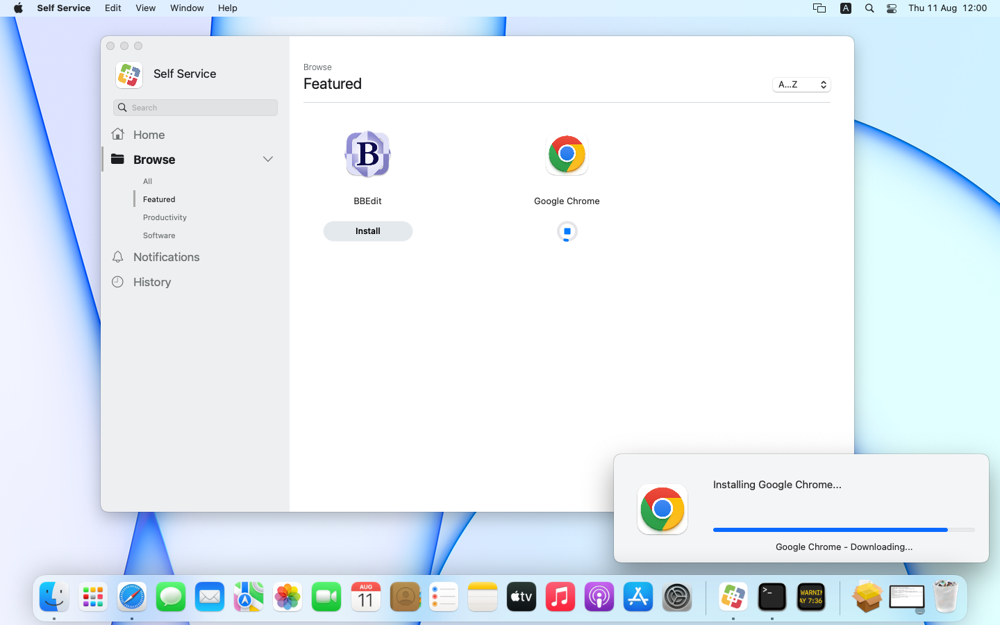

# Display Installomator Progress with SwiftDialog in Jamf

Installomator 10 has functionality to communicate with [Bart Reardon's swiftDialog](https://github.com/swiftDialog/swiftDialog). When you set the `DIALOG_CMD_FILE` variable Installomator will write progress for downloads and installation (with pkgs) to the command file which allows swiftDialog to display the progress.

However, you have to launch and setup swiftDialog to display a window with a progress bar before Installomator launches and also make sure swiftDialog quits after Installomator has run. This may seem complex at first but allows to configure swiftDialog just for your case without needing to modify the Installomator script.

Here are some example script that would run before and after Installomator to display a swiftDialog window and quit the process after. Since Jamf Pro executes scripts in alphanumerical order, the names are chosen accordingly, to ensure proper order.

## Setup in Jamf Pro

To show Installomator progress with swiftDialog from a Jamf Policy, you require three scripts:

- `00_Prepare_SwiftDialog.sh`: Configures and displays the swiftDialog window
- `Installomator.sh`: (v10 or higher)
- `zz_Quit_SwiftDialog.sh`: quits swiftDialog

Add these three scripts to your Jamf Pro and create a policy with these three scripts. The names are chosen that the script appear in the correct order. If you rename the scripts in Jamf Pro, this may disrupt the order and the workflow will not work anymore. The "Priority" of the scripts in the policy should all be the same value.

The different scripts require a set of parameters. We will use the `googlechromepkg` label as an example.

### `00_Prepare_SwiftDialog.sh`

Parameter 4: `/var/tmp/dialog.log` (Path to the swiftDialog command file)

Parameter 5: `Installing Google Chrome...` (text shown in the swiftDialog window above the progress bar)

Parameter 6: Path to or URL for an icon in swiftDialog. Value can be a path on the client or a URL. See Dan Snelson's advice on how to get icon URLs for Self Service icons: https://rumble.com/v119x6y-harvesting-self-service-icons.html

Parameter 7: Path to or URL for an overlay icon in swiftDialog. Could be company logo. Value can be a path on the client or a URL. If not configured, custom Dialog icon will be used, or fallback Jamf Self Service icon.

### `Installomator.sh`

Parameter 4: `googlechromepkg` (the label to install)

Parameter 5: `DIALOG_CMD_FILE=/var/tmp/dialog.log` (the swiftDialog command file, this has to be the same value as parameter 4 in the previous script)

Parameter 6: `NOTIFY=silent` (disable Installomator notifications, optional)

You can add more configurations to the Installomator script when needed.

### `zz_Quit_SwiftDialog`

Parameter 4: `/var/tmp/dialog.log` (the swiftDialog command file, this has to be the same value as parameter 4 in the first script)

Parameter 5: Jamf recon (if value is `1`) done as part of this script, so the user gets the progress in the dialog window (default `0`)

Then setup the remainder of the Jamf Policy to your needs. This works best with Self Service policies.

When you run the policy, the first script will configure and display swiftDialog. Installomator.sh will download and install the app while writing the proper update commands to the file set in `DIALOG_CMD_FILE`. The final script will quit swiftDialog.

## Extra scripts for Jamf Pro

- `-0_Install icon for swiftDialog.sh`: Will install an icon for SwiftDialog so that it will be used in notifications and as optional overlay icon
- `-0_Install swiftDialog direct.sh`: Will directly download latest version of SwiftDialog from GitHub, and install it on the client Mac. This is great to be run periodically, like weekly

### `-0_Install icon for swiftDialog.sh`

Parameter 4: Custom icon for swiftDialog. Value can be a path on the client or a URL.

Parameter 5: Remove old icon (if value is `1`) or not (default `0`). Removing the icon forces a new install of swiftDialog regardless of installed version.

### `-0_Install swiftDialog direct.sh`

Parameter 4: Custom icon for swiftDialog. Value can be a path on the client or a URL. If no icon is provided Self Service icon will be used.

Parameter 5: Remove old icon (if value is `1`) or not (default `0`). Removing the icon forces a new install of swiftDialog regardless of installed version.

